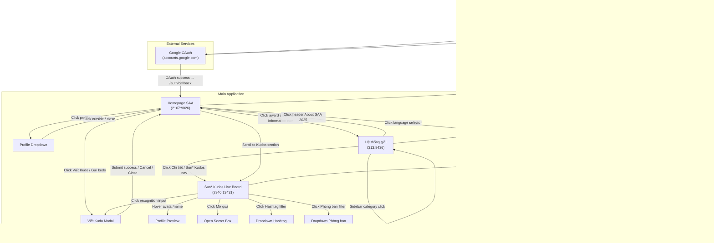
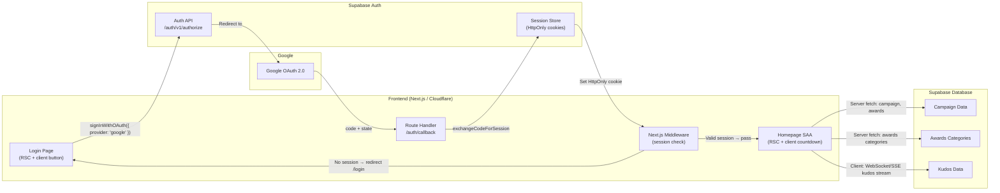

# Screen Flow Overview

## Project Info
- **Project Name**: Agentic Coding Hands-on (SAA 2025)
- **Figma File Key**: `9ypp4enmFmdK3YAFJLIu6C`
- **Figma URL**: https://www.figma.com/design/9ypp4enmFmdK3YAFJLIu6C
- **Created**: 2026-03-09
- **Last Updated**: 2026-03-17

---

## Discovery Progress

| Metric | Count |
|--------|-------|
| Total Screens | TBD |
| Discovered | 7 |
| Remaining | TBD |
| Completion | — |

---

## Screens

| # | Screen Name | Frame ID | Figma Link | Status | Detail File | Predicted APIs | Navigations To |
|---|-------------|----------|------------|--------|-------------|----------------|----------------|
| 1 | Login | `662:14387` | [Open in Figma](https://momorph.ai/files/9ypp4enmFmdK3YAFJLIu6C/frames/662:14387) | discovered | [spec.md](specs/662-14387-Login/spec.md) | `GET /auth/callback` (Supabase OAuth) | Homepage SAA, Dropdown-ngôn ngữ (`721:4942`) |
| 2 | Homepage SAA | `2167:9026` | [Open in Figma](https://www.figma.com/design/9ypp4enmFmdK3YAFJLIu6C?node-id=2167-9026) | discovered | [spec.md](specs/2167-9026-HomepageSAA/spec.md) | `GET /api/campaign/active`, `GET /api/awards/categories`, `GET /api/kudos/live` | Dropdown-profile, Dropdown-ngôn ngữ, Hệ thống giải (`313:8436`), Sun* Kudos Live board, Viết Kudo |
| 3 | Viết Kudo | `520:11602` | [Open in Figma](https://www.figma.com/design/9ypp4enmFmdK3YAFJLIu6C?node-id=520-11602) | discovered | [spec.md](specs/520-11602-VietKudo/spec.md) | `GET /api/users/search`, `GET /api/badges`, `POST /api/kudos`, Supabase Storage | Homepage SAA (on close/success) |
| 4 | Hệ thống giải (Award System) | `313:8436` | [Open in Figma](https://www.figma.com/design/9ypp4enmFmdK3YAFJLIu6C?node-id=313-8436) | discovered | [spec.md](specs/313-8436-HeThongGiai/spec.md) | `GET /api/awards` (predicted) | Homepage SAA (header nav), Sun* Kudos (Chi tiết button), Login (session expiry) |
| 5 | Dropdown Ngôn Ngữ (Language Selector) | `721:4942` | [Open in Figma](https://momorph.ai/files/9ypp4enmFmdK3YAFJLIu6C/frames/721:4942) | discovered | [spec.md](specs/721-4942-DropdownNgonNgu/spec.md) | N/A (client-side only) | Same page (in-place language switch) |
| 6 | Countdown — Prelaunch Page | `2268:35127` | [Open in Figma](https://momorph.ai/files/9ypp4enmFmdK3YAFJLIu6C/frames/2268:35127) | discovered | [spec.md](specs/2268-35127-CountdownPrelaunchPage/spec.md) | `GET /api/campaign/active` (existing) | Homepage SAA (on countdown expiry) |
| 7 | Sun* Kudos - Live board | `2940:13431` | [Open in Figma](https://www.figma.com/design/9ypp4enmFmdK3YAFJLIu6C?node-id=2940-13431) | discovered | [spec.md](specs/2940-13431-SunKudosLiveBoard/spec.md) | `GET /api/kudos/highlight`, `GET /api/kudos`, `GET /api/kudos/stats`, `GET /api/sunners/spotlight`, `GET /api/sunners/gift-recipients`, `POST /api/kudos/{id}/like` | Viết Kudo (`520:11602`), Profile Preview (`721:5827`), Open Secret Box (`1466:7676`), Dropdown Hashtag (`1002:13013`), Dropdown Phòng ban (`721:5684`) |

---

## Navigation Graph

---

## Screen Groups

### Group: Authentication
| Screen | Purpose | Entry Points |
|--------|---------|--------------|
| Login | Single-action Google OAuth entry point to SAA 2025 | App launch, session expiry, logout |
| Language Dropdown (`721:4942`) | Overlay to switch UI language | Language selector button on Login header |

### Group: Main Application
| Screen | Purpose | Entry Points |
|--------|---------|--------------|
| Homepage SAA (`2167:9026`) | Main hub post-authentication — campaign branding, awards system, kudos | Successful Google OAuth callback, header nav |
| Sun* Kudos Live Board (`2940:13431`) | Real-time kudos board — highlight carousel, spotlight word cloud, all kudos feed, personal stats, Secret Box, sunner leaderboards | Homepage SAA scroll/link, Award System "Sun* Kudos" nav |
| Hệ thống giải (`313:8436`) | Award system page — 6 award categories (Top Talent, Top Project, Top Project Leader, Best Manager, Signature 2025 - Creator, MVP) with sidebar navigation, descriptions, quantities, prize values, and Sun* Kudos promo | Award card / "Award Information" nav from Homepage SAA, header nav |
| Viết Kudo (`520:11602`) | Modal dialog for composing and sending kudos to teammates | "Viết Kudo" / "Gửi kudo" button on Homepage SAA Kudos section |

---

## API Endpoints Summary

| Endpoint | Method | Screens Using | Purpose |
|----------|--------|---------------|---------|
| Supabase `/auth/v1/authorize?provider=google` | GET | Login | Initiate Google OAuth flow |
| Next.js `/auth/callback` | GET | Login (OAuth return) | Handle OAuth code exchange, set session cookies, redirect |
| Next.js Middleware | — | All protected routes | Verify Supabase session; redirect to Login if unauthenticated |
| `/api/campaign/active` | GET | Homepage SAA | Fetch active campaign info (name, event_date, description) |
| `/api/awards/categories` | GET | Homepage SAA, Hệ thống giải | Fetch all award categories with badges and prizes |
| `/api/awards` | GET | Hệ thống giải | Fetch award categories with descriptions and values (predicted) |
| `/api/kudos/live` | GET | Homepage SAA | Fetch recent kudos for the live board |
| `/api/kudos/live/stream` | WebSocket/SSE | Homepage SAA | Real-time kudos stream |
| `/api/users/search?q={query}` | GET | Viết Kudo | Search colleagues for recipient selection |
| `/api/badges` | GET | Viết Kudo | Fetch available recognition badges (Danh hiệu) |
| `/api/kudos` | POST | Viết Kudo | Submit a kudo (recipients, badge, content, hashtags, image_urls) |
| Supabase Storage `/kudos-images/{uuid}` | PUT | Viết Kudo | Upload image attachments before kudo submission |
| `/api/kudos/highlight` | GET | Sun* Kudos Live Board | Fetch top-5 highlight kudos (most hearts) |
| `/api/kudos` | GET | Sun* Kudos Live Board | Fetch paginated all-kudos feed |
| `/api/kudos/stats` | GET | Sun* Kudos Live Board | Fetch personal kudos stats (received, sent, hearts, Secret Boxes) |
| `/api/kudos/spotlight` | GET | Sun* Kudos Live Board | Fetch spotlight data (names + kudos counts for word cloud) |
| `/api/sunners/gift-recipients` | GET | Sun* Kudos Live Board | Fetch 10 most recent gift recipients |
| `/api/kudos/{id}/like` | POST | Sun* Kudos Live Board | Toggle like on a kudo |
| `/api/hashtags` | GET | Sun* Kudos Live Board | Fetch available hashtags for filter dropdown |
| `/api/departments` | GET | Sun* Kudos Live Board | Fetch departments for filter dropdown |

---

## Data Flow

---

## Technical Notes

### Authentication Flow
- **Provider**: Google OAuth 2.0 via Supabase Auth
- **Session storage**: `HttpOnly` cookies managed by `@supabase/ssr` (OWASP A07 compliant)
- **Callback route**: Next.js Route Handler at `/auth/callback` — edge-compatible
- **Auto-redirect**: Middleware detects existing session and redirects authenticated users away from `/login`

### State Management
- Global auth state: Supabase session (server-side via cookies)
- Login page local state: `isLoading` (button), `error` (OAuth failure message)
- Homepage local state: `countdown` (client-side timer), `kudosFeed` (real-time stream)
- Award System local state: `activeAwardId` (scroll-spy active category), `isMenuVisible` (mobile menu toggle)
- Language preference: client-side state / future i18n context

### Routing
- Router: Next.js 15 App Router
- Protected routes: enforced via Next.js middleware reading Supabase session cookie
- Public routes: `/login`, `/auth/callback`

---

## Discovery Log

| Date | Action | Screens | Notes |
|------|--------|---------|-------|
| 2026-03-09 | Initial discovery | Login (`662:14387`) | First screen — authentication entry point |
| 2026-03-10 | Specify screen | Homepage SAA (`2167:9026`) | Main landing page — campaign branding, awards, kudos |
| 2026-03-11 | Specify screen | Viết Kudo (`520:11602`) | Kudos composition modal — send appreciation to teammates |
| 2026-03-12 | Specify screen | Hệ thống giải (`313:8436`) | Award system page — 6 categories with sidebar nav, descriptions, prize values |
| 2026-03-13 | Specify screen | Dropdown Ngôn Ngữ (`721:4942`) | Language selector dropdown — VN/EN switch with gold border, shared component |
| 2026-03-13 | Specify screen | Countdown Prelaunch (`2268:35127`) | Fullscreen prelaunch countdown — LED-style digit cards, glass-morphism, standalone page |
| 2026-03-17 | Specify screen | Sun* Kudos - Live board (`2940:13431`) | Kudos live board — highlight carousel, spotlight word cloud, all kudos feed, stats, Secret Box, leaderboards |

---

## Next Steps

- [x] ~~Run `/momorph.specify` for Homepage SAA~~
- [x] ~~Run `/momorph.specify` for Viết Kudo~~
- [x] ~~Run `/momorph.specify` for Hệ thống giải (Award System)~~
- [x] ~~Run `/momorph.specify` for remaining screens (Kudos Live Board, etc.)~~
- [ ] Update discovery progress once total screen count is known
- [ ] Map all API endpoints from additional screens
- [ ] Verify navigation paths with design team
- [ ] Add Dashboard and other main app screens to this flow
